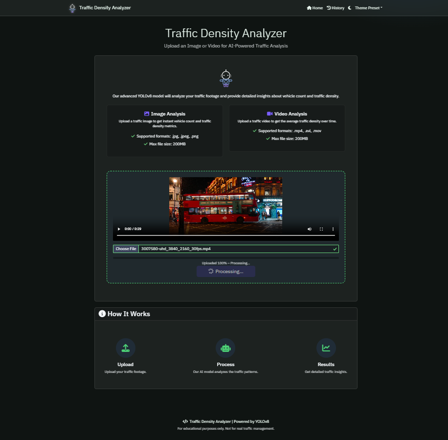
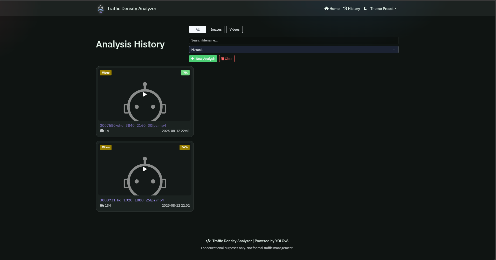

<div align="center">
  <h1>🚦 Traffic Density Analyzer</h1>
  <p>AI-powered traffic analysis (images/videos) with YOLOv8, unique vehicle counting, density timeline, upload progress, and an upgraded, modern UI.</p>
  
  <a href="https://www.python.org/"></a>
  <a href="https://flask.palletsprojects.com/"></a>
  <a href="https://github.com/ultralytics/ultralytics"></a>
  <a href="LICENSE"></a>
  <a href="https://github.com/Ar141204/TrafficDensityAnalyzer"></a>
</div>

---

## ✨ Features

- **Real Upload Progress**: Upload images/videos with real percentage feedback
- **Smart Detection**: YOLOv8-based unique vehicle counting & per-class stats (car, truck, bus, motorcycle)
- **Interactive Timeline**: Density over time chart synced to the video timeline (click chart to scrub)
- **Badges**: "No Motorcycles" and "Low Confidence" indicators
- **Threshold Presets**: Adjustable (confidence, IOU) with re-run UI, auto-applied to next upload
- **Results Export**: CSV, JSON, and KPI overlay snapshot JPG
- **History Page**: Search, filter, sort, and clear all analysis
- **Modern UI**: Theme presets (Slate/Neon/Forest), light/dark toggle, accessible focus states

## 🛠️ Tech Stack

### Backend
- **Framework**: Flask (Python)
- **Object Detection**: YOLOv8 (Ultralytics)
- **Video Processing**: OpenCV, FFmpeg
- **Database**: SQLite (with SQLAlchemy)
- **Environment**: python-dotenv

### Frontend
- **Templating**: Jinja2
- **Charts**: Chart.js (with datalabels plugin)
- **Styling**: Custom CSS (theme variables, glassmorphism)
- **JS Logic**: XHR upload, drag-and-drop, timeline sync

### Development Tools
- **Package Manager**: pip
- **Version Control**: Git
- **Environment Management**: venv, .env files

## 🚀 Quick Start

### Prerequisites
- Python 3.10–3.12
- FFmpeg (recommended for video support)
- Git

### Installation

1. **Clone the repository**
   ```bash
   git clone https://github.com/Ar141204/TrafficDensityAnalyzer.git
   cd TrafficDensityAnalyzer
   ```

2. **Set up the environment**
   ```bash
   python -m venv venv
   # Windows:
   venv\Scripts\activate
   # macOS/Linux:
   # source venv/bin/activate

   pip install -r requirements.txt
   ```

3. **Configure environment**
   ```bash
   cp .env.example .env
   # ...edit .env as needed
   ```

4. **Run the app**
   ```bash
   python main.py
   # or:
   # set FLASK_APP=main.py && flask run
   ```

App will be available at `http://127.0.0.1:5000/`.

## 🖼️ Demo

Below are sample screenshots of the Traffic Density Analyzer in action:

<p align="center">
  
</p>
<p align="center">
  
</p>
<p align="center">
  
</p>

## 📝 Usage

1. Open Home page → drag-and-drop or select file
2. Watch the percentage upload bar; when it reaches 100% it switches to "Processing…"
3. Results page shows:
   - KPIs (total, density, per-class counts)
   - Density timeline synced to video (click the chart to scrub)
   - Badges: "No Motorcycles" and/or "Low Confidence" when applicable
   - Quick actions: Download CSV, JSON, Snapshot JPG
4. Optional: Open "Re-run" panel (top-right slider icon) to save a threshold preset for future uploads.

### Threshold Preset
- Sliders for global confidence, motorcycle confidence, and IOU
- Saved to `localStorage`; auto-sent with next upload

## 🌐 API Endpoints

- `POST /process_file` → process uploaded file (optional: `conf_global`, `motorcycle_conf`, `iou_thresh`)
- `GET  /report/<filename>` → CSV download
- `GET  /report/json/<analysis_id>` → JSON payload
- `GET  /snapshot/<analysis_id>` → KPI snapshot JPG
- `GET  /history` → history page
- `POST /history/clear` → delete all history and associated files

## 📁 Project Structure

```
.
├─ main.py                 # Flask app, routes, processing flow
├─ app/
│  ├─ __init__.py
│  ├─ models.py           # SQLAlchemy models
│  └─ utils.py            # YOLOv8 video/image processing
├─ templates/              # Jinja templates
├─ static/
│  ├─ css/                # Styles
│  ├─ js/                 # Frontend logic
│  ├─ img/                # Logos/icons
│  ├─ screenshots/        # Demo screenshots
│  ├─ uploads/            # Ignored; user uploads
│  └─ results/            # Ignored; processed/exports
├─ instance/               # SQLite DB (ignored)
├─ .env.example            # Sample env
├─ .gitignore              # Excludes venv, media, logs, weights
├─ requirements.txt        # Python dependencies
└─ pyproject.toml          # Metadata
```

## 🛠️ Development

- **Frontend**
  - Real upload progress via XHR; drag-and-drop and inline validation
  - Density chart with Chart.js; datalabels plugin enabled
  - Theme presets; accessible focus rings; light/dark toggle persisted
- **Backend**
  - `app.utils.process_video(input, output, *, conf_global, motorcycle_conf, iou_thresh)` returns:
    - `total_vehicles`, `vehicle_counts{car,truck,bus,motorcycle}`
    - `density` (overall), `density_series` (timeline), `avg_confidence`, `low_confidence`

## 🛣️ Roadmap

- Background jobs (RQ) + SSE progress
- ByteTrack/DeepSORT tracking for more accurate unique counts
- FFmpeg normalization & thumbnails + resumable uploads (tus)
- Object storage (S3/minio) for media, signed URLs
- Dockerfile & Compose + GitHub Actions CI

## 🩺 Troubleshooting

- Upload fails immediately → check file type/size and `.env` limits
- Video doesn’t play → install FFmpeg and try a standard H.264/AAC MP4
- UI too bright → use theme toggle in navbar
- Reset stale caching → hard refresh (Ctrl+F5)

## 🙏 Acknowledgments

- Detection: [YOLOv8 by Ultralytics](https://github.com/ultralytics/ultralytics)
- Charts: [Chart.js](https://www.chartjs.org/)
- Frontend inspiration: glassmorphism, neon UI themes

## 🤝 Contributing

Contributions are welcome! Please feel free to submit a Pull Request.
1. Fork the repository
2. Create your feature branch (`git checkout -b feature/AmazingFeature`)
3. Commit your changes (`git commit -m 'Add some AmazingFeature'`)
4. Push to the branch (`git push origin feature/AmazingFeature`)
5. Open a Pull Request

## 📄 License

This project is licensed under the MIT License - see the [LICENSE](LICENSE) file for details.

---

<p align="center">
  <b>Created and copyright © by Ar141204</b>
</p>
